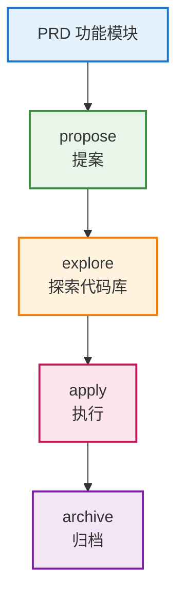

# 开发阶段（核心流程）

### propose（提案）

生成规范文档：
- proposal.md（变更提案）
- design.md（技术设计）
- spec（功能规格）
- task（任务列表）

### explore（探索）

探索代码库：
- 理解现有架构
- 找到相关代码
- 评估影响范围

### apply（执行）

执行任务：
- 读取 tasks.md
- 触发 superpowers
- 生成代码

### archive（归档）

归档变更：
- 移动到 archive/
- 保留历史记录
- 便于追溯

