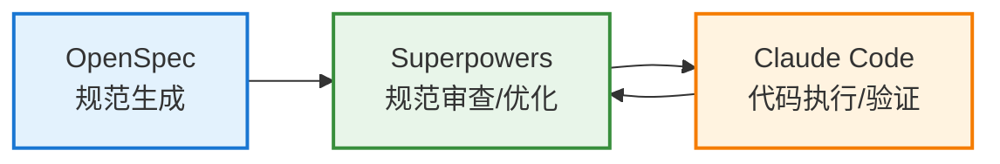

# 完整方案

**Claude Code + OpenSpec + Superpowers**

三者协同，构建完整的 AI 编程工作流

### OpenSpec

结构化规范

- 定义"是什么"
- 生成规范文档
- 可追溯、可沉淀

### Superpowers

自动化能力增强

- 审查和优化规范
- TDD 质量保证
- 结构化工作流

### Claude Code

深度代码理解

- 根据规范执行
- 自主编程
- 验证结果

