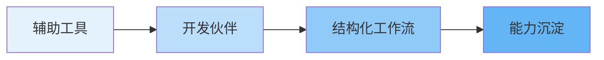
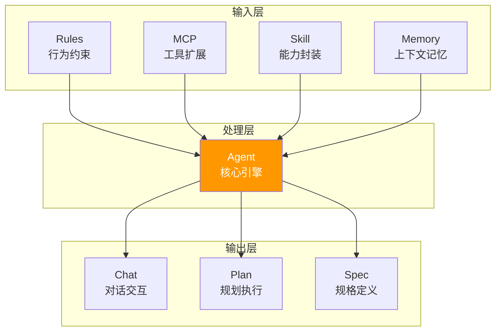
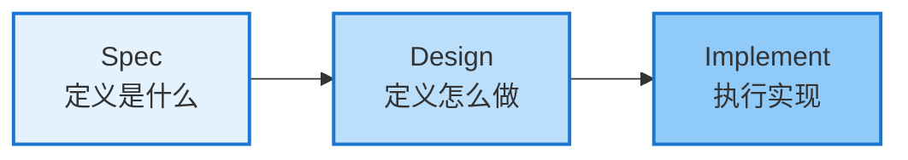
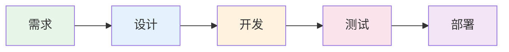
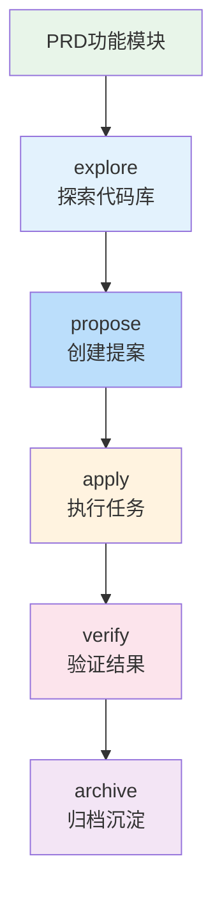

---
# Slidev 配置
theme: ../../packages/slidev-theme-skill-ui
title: AI Coding 实践分享
author: eliduty
aspectRatio: 16/9
colorSchema: auto

# 元数据
id: ai-coding
created: 2026-03-30
updated: 2026-03-30
tags: [ai, coding, productivity]
status: draft
---

<!--
  AI Coding 实践分享 - 内部技术分享
  时长：约 20-30 分钟
-->

<!-- ========== Part 1: 开场 ========== -->

# AI Coding 实践分享

<v-clicks>

**从对话到 Agent，重新定义开发流程**

<div class="mt-8 text-sm opacity-60">
内部技术分享 · 2026-03-30
</div>

</v-clicks>

---
layout: two-cols
---

# 为什么关注 AI Coding

<v-clicks>

### 关键转折点

AI Coding 已从 **"辅助工具"** 进化为 **"开发伙伴"**

**Skill 的出现是关键转折：**

- 从"对话"到"结构化工作流"
- 可复用、可组合的能力单元
- 重新审视开发流程的契机

</v-clicks>

::right::

<div class="ml-8">



<v-click>

<div class="mt-4 p-4 bg-amber-50 dark:bg-amber-900/20 rounded-lg">

**核心洞察**

上下文工程正在取代提示词工程

</div>

</v-click>

</div>

---
layout: section
---

<!-- ========== Part 2: AI Coding 演进史 ========== -->

# AI Coding 演进史

---

# 发展历程

<div class="grid grid-cols-4 gap-4 mt-8">

<div v-click class="p-4 bg-blue-50 dark:bg-blue-900/20 rounded-lg">

### Web 对话
<div class="text-xs opacity-60 mt-2">2022-2023</div>

<v-clicks>

- 上下文断裂
- 复制粘贴
- 需要手动整合

</v-clicks>

</div>

<div v-click class="p-4 bg-green-50 dark:bg-green-900/20 rounded-lg">

### 浏览器插件
<div class="text-xs opacity-60 mt-2">2023</div>

<v-clicks>

- 集成但受限
- 依赖特定平台
- 体验割裂

</v-clicks>

</div>

<div v-click class="p-4 bg-purple-50 dark:bg-purple-900/20 rounded-lg">

### AI IDE
<div class="text-xs opacity-60 mt-2">2024</div>

<v-clicks>

- 一体化体验
- Cursor 引领
- 实时辅助

</v-clicks>

</div>

<div v-click class="p-4 bg-orange-50 dark:bg-orange-900/20 rounded-lg">

### 终端 Agent
<div class="text-xs opacity-60 mt-2">2025+</div>

<v-clicks>

- 深度理解
- 自主执行
- Claude Code

</v-clicks>

</div>

</div>

---
layout: center
---

# 主流 AI Coding 工具

<div class="grid grid-cols-2 gap-8 mt-12 max-w-3xl">

<div v-click class="flex items-center gap-4">
<div class="w-12 h-12 bg-blue-100 dark:bg-blue-800 rounded-lg flex items-center justify-center text-2xl">🤖</div>
<div>
<h3 class="font-bold">Claude Code</h3>
<p class="text-sm opacity-70">终端原生 Agent，自主执行</p>
</div>
</div>

<div v-click class="flex items-center gap-4">
<div class="w-12 h-12 bg-purple-100 dark:bg-purple-800 rounded-lg flex items-center justify-center text-2xl">✨</div>
<div>
<h3 class="font-bold">Cursor</h3>
<p class="text-sm opacity-70">AI IDE 先行者，一体化体验</p>
</div>
</div>

<div v-click class="flex items-center gap-4">
<div class="w-12 h-12 bg-green-100 dark:bg-green-800 rounded-lg flex items-center justify-center text-2xl">🛩️</div>
<div>
<h3 class="font-bold">GitHub Copilot</h3>
<p class="text-sm opacity-70">微软生态，广泛集成</p>
</div>
</div>

<div v-click class="flex items-center gap-4">
<div class="w-12 h-12 bg-teal-100 dark:bg-teal-800 rounded-lg flex items-center justify-center text-2xl">🌊</div>
<div>
<h3 class="font-bold">Windsurf</h3>
<p class="text-sm opacity-70">Codeium 出品，流畅体验</p>
</div>
</div>

</div>

---
layout: section
---

<!-- ========== Part 3: AI Agent 能力模型 ========== -->

# AI Agent 能力模型

---

# AI Agent 核心组件

<div class="mt-8">



</div>

---

# 关键概念解释

<div class="grid grid-cols-2 gap-6 mt-8">

<v-click>

<div class="p-6 border border-blue-200 dark:border-blue-800 rounded-lg">

### Rules - 行为约束

<v-clicks>

- 项目编码规范
- 安全审计清单
- 架构决策约束

<div class="mt-3 text-sm opacity-70">
示例：CLAUDE.md 存储项目规则
</div>

</v-clicks>

</div>

</v-click>

<v-click>

<div class="p-6 border border-green-200 dark:border-green-800 rounded-lg">

### MCP - 工具扩展协议

<v-clicks>

- Model Context Protocol
- 安全访问外部数据源
- 按需加载策略

<div class="mt-3 text-sm opacity-70">
避免一次性加载大量 API 定义
</div>

</v-clicks>

</div>

</v-click>

<v-click>

<div class="p-6 border border-purple-200 dark:border-purple-800 rounded-lg">

### Skill - 可复用能力

<v-clicks>

- 结构化工作流封装
- `/opsx:propose` `/opsx:apply`
- 团队能力沉淀

<div class="mt-3 text-sm opacity-70">
从"对话"到"结构化执行"
</div>

</v-clicks>

</div>

</v-click>

<v-click>

<div class="p-6 border border-orange-200 dark:border-orange-800 rounded-lg">

### Memory - 上下文记忆

<v-clicks>

- 会话状态持久化
- 跨会话知识积累
- 自动记忆机制

<div class="mt-3 text-sm opacity-70">
MEMORY.md 记录调试心得、用户偏好
</div>

</v-clicks>

</div>

</v-click>

</div>

---

# Claude Code Agent 循环

<div class="mt-8 flex justify-center">


</div>

<v-clicks>

<div class="mt-8 grid grid-cols-3 gap-4">

<div class="p-4 bg-green-50 dark:bg-green-900/20 rounded-lg">

**收集上下文**
- 文件搜索
- Git 状态检查
- 读取 CLAUDE.md

</div>

<div class="p-4 bg-blue-50 dark:bg-blue-900/20 rounded-lg">

**采取行动**
- 跨文件编辑
- 终端工具操作
- 执行重构

</div>

<div class="p-4 bg-orange-50 dark:bg-orange-900/20 rounded-lg">

**验证结果**
- 自动运行测试
- 捕捉错误
- 调整方案

</div>

</div>

</v-clicks>

---
layout: center
---

# Skill 的核心意义

<v-clicks>

<div class="max-w-2xl">

> **从"对话"到"结构化工作流"**

<div class="mt-8 grid grid-cols-3 gap-6 text-center">

<div class="p-6 bg-gradient-to-br from-blue-50 to-blue-100 dark:from-blue-900/30 dark:to-blue-800/30 rounded-xl">
<div class="text-4xl mb-2">🔄</div>
<div class="font-bold">可复用</div>
<div class="text-sm opacity-60">一次定义，多次执行</div>
</div>

<div class="p-6 bg-gradient-to-br from-green-50 to-green-100 dark:from-green-900/30 dark:to-green-800/30 rounded-xl">
<div class="text-4xl mb-2">🧩</div>
<div class="font-bold">可组合</div>
<div class="text-sm opacity-60">能力单元自由拼接</div>
</div>

<div class="p-6 bg-gradient-to-br from-purple-50 to-purple-100 dark:from-purple-900/30 dark:to-purple-800/30 rounded-xl">
<div class="text-4xl mb-2">📦</div>
<div class="font-bold">可沉淀</div>
<div class="text-sm opacity-60">团队知识资产积累</div>
</div>

</div>

<div class="mt-8 p-6 bg-amber-50 dark:bg-amber-900/20 rounded-lg border-2 border-amber-200 dark:border-amber-800">

**重新审视开发流程的契机**

Skill 让我们有机会把隐性的开发经验转化为显性的、可复用的能力单元。

</div>

</div>

</v-clicks>

---
layout: section
---

<!-- ========== Part 4: Spec-Driven Development ========== -->

# Spec-Driven Development

---

# 什么是 SDD？

<div class="mt-8">

<v-clicks>

> **规格驱动开发（Spec-Driven Development）**
>
> 在写任何一行代码之前，先锁定机器可读、人可评审的规格文档。

</v-clicks>

<v-click>

<div class="mt-8 flex justify-center">



</div>

</v-click>

<v-clicks>

<div class="mt-6 grid grid-cols-2 gap-6">

<div class="p-4 bg-red-50 dark:bg-red-900/20 rounded-lg border border-red-300 dark:border-red-800">

**❌ 传统方式的问题**

- 需求淹没在聊天历史中
- 模糊提示导致不确定输出
- 多个功能混在一起
- 团队不知情，难以协作

</div>

<div class="p-4 bg-green-50 dark:bg-green-900/20 rounded-lg border border-green-300 dark:border-green-800">

**✅ SDD 的优势**

- 独立规范文件夹，可追溯
- 明确规范带来可预测结果
- 每个变更独立文件夹结构
- 规范文档可共享和审查

</div>

</div>

</v-clicks>

</div>

---

# OpenSpec 工件体系

<div class="mt-6">

<v-click>

每个变更（Change）都被组织在独立的文件夹中：

</v-click>

<div class="grid grid-cols-4 gap-4 mt-6">

<div v-click class="p-4 bg-blue-50 dark:bg-blue-900/20 rounded-lg">

### proposal.md

<v-clicks>

<div class="text-sm mt-2">

**为什么做**

- 变更初衷
- 目标范围
- 风险评估
- 回滚计划

</div>

</v-clicks>

</div>

<div v-click class="p-4 bg-green-50 dark:bg-green-900/20 rounded-lg">

### specs/

<v-clicks>

<div class="text-sm mt-2">

**逻辑规格**

- 场景描述
- Given/When/Then
- 功能需求
- 非功能需求

</div>

</v-clicks>

</div>

<div v-click class="p-4 bg-purple-50 dark:bg-purple-900/20 rounded-lg">

### design.md

<v-clicks>

<div class="text-sm mt-2">

**技术方案**

- 架构概述
- 组件设计
- 数据设计
- API 设计

</div>

</v-clicks>

</div>

<div v-click class="p-4 bg-orange-50 dark:bg-orange-900/20 rounded-lg">

### tasks.md

<v-clicks>

<div class="text-sm mt-2">

**任务清单**

- 原子化任务
- 执行路径图
- 依赖关系
- 完成标准

</div>

</v-clicks>

</div>

</div>

</div>

---

# OpenSpec 工作流

<div class="mt-8 flex justify-center">

```mermaid {scale: 0.7}
graph TB
    P[/opsx:propose<br/>创建提案] --> E[/opsx:explore<br/>探索想法]
    E --> A[/opsx:apply<br/>实现任务]
    A --> AR[/opsx:archive<br/>归档沉淀]

    style P fill:#4caf50,color:#fff
    style E fill:#2196f3,color:#fff
    style A fill:#ff9800,color:#fff
    style AR fill:#9c27b0,color:#fff
```

</div>

<v-clicks>

<div class="mt-6 grid grid-cols-2 gap-6 max-w-3xl mx-auto">

<div class="p-4 border border-gray-200 dark:border-gray-700 rounded-lg">

**核心命令**

| 命令 | 说明 |
|------|------|
| `/opsx:propose` | 创建变更和规划文档 |
| `/opsx:explore` | 探索想法，调查问题 |
| `/opsx:apply` | 实现任务 |
| `/opsx:archive` | 归档完成的变更 |

</div>

<div class="p-4 border border-gray-200 dark:border-gray-700 rounded-lg">

**核心价值**

<v-clicks>

- ✅ 可预测性 — 明确规范带来可预测输出
- ✅ 组织性 — 每个变更独立文件夹结构
- ✅ 灵活性 — 随时更新任何文档
- ✅ 工具自由 — 支持 20+ AI 编码助手

</v-clicks>

</div>

</div>

</v-clicks>

---
layout: section
---

<!-- ========== Part 5: 项目实战流程 ========== -->

# 项目实战流程

---

# 全流程概览

<div class="mt-8 flex justify-center">



</div>

<v-clicks>

<div class="mt-8 grid grid-cols-5 gap-4">

<div class="p-4 text-center">
<div class="text-3xl mb-2">📋</div>
<div class="font-bold text-sm">需求阶段</div>
<div class="text-xs opacity-60 mt-1">PRD → 小系统拆分</div>
</div>

<div class="p-4 text-center">
<div class="text-3xl mb-2">🎨</div>
<div class="font-bold text-sm">设计阶段</div>
<div class="text-xs opacity-60 mt-1">架构 + 技术方案</div>
</div>

<div class="p-4 text-center">
<div class="text-3xl mb-2">⚙️</div>
<div class="font-bold text-sm">开发阶段</div>
<div class="text-xs opacity-60 mt-1">OpenSpec 工作流</div>
</div>

<div class="p-4 text-center">
<div class="text-3xl mb-2">🧪</div>
<div class="font-bold text-sm">测试阶段</div>
<div class="text-xs opacity-60 mt-1">E2E + 单元测试</div>
</div>

<div class="p-4 text-center">
<div class="text-3xl mb-2">🚀</div>
<div class="font-bold text-sm">部署阶段</div>
<div class="text-xs opacity-60 mt-1">CI/CD 集成</div>
</div>

</div>

</v-clicks>

---

# 需求 & 设计阶段

<div class="grid grid-cols-2 gap-8 mt-6">

<div v-click>

### 需求阶段

<v-clicks>

<div class="mt-4 space-y-3">

<div class="p-3 bg-gray-50 dark:bg-gray-800 rounded">

**PRD 拆分**

将大型 PRD 拆分为小系统 PRD

</div>

<div class="p-3 bg-gray-50 dark:bg-gray-800 rounded">

**功能模块划分**

按业务领域拆分功能模块

</div>

<div class="p-3 bg-gray-50 dark:bg-gray-800 rounded">

**优先级排序**

P0/P1/P2 优先级定义

</div>

</div>

</v-clicks>

</div>

<div v-click>

### 设计阶段

<v-clicks>

<div class="mt-4 space-y-3">

<div class="p-3 bg-gray-50 dark:bg-gray-800 rounded">

**架构设计**

系统整体架构规划

</div>

<div class="p-3 bg-gray-50 dark:bg-gray-800 rounded">

**技术方案设计**

数据模型、API 设计

</div>

<div class="p-3 bg-gray-50 dark:bg-gray-800 rounded">

**工具支持**

Pencil Plugin + MCP + Claude Code

</div>

</div>

</v-clicks>

</div>

</div>

---

# 开发阶段（核心流程）

<div class="mt-6">



</div>

<v-clicks>

<div class="mt-6 grid grid-cols-3 gap-4">

<div class="p-3 bg-blue-50 dark:bg-blue-900/20 rounded-lg text-sm">

**explore**
探索现有代码库，理解架构

</div>

<div class="p-3 bg-green-50 dark:bg-green-900/20 rounded-lg text-sm">

**propose**
生成 proposal、design、spec、task

</div>

<div class="p-3 bg-purple-50 dark:bg-purple-900/20 rounded-lg text-sm">

**apply**
按 tasks.md 逐项执行，触发 superpowers

</div>

</div>

<div class="mt-4 grid grid-cols-2 gap-4">

<div class="p-3 bg-orange-50 dark:bg-orange-900/20 rounded-lg text-sm">

**verify**
运行测试，验证实现符合规格

</div>

<div class="p-3 bg-pink-50 dark:bg-pink-900/20 rounded-lg text-sm">

**archive**
归档变更，知识固化到主规格

</div>

</div>

</v-clicks>

---

# 实战案例：档案编研智能辅助选题系统

<v-clicks>

<div class="mt-6 p-4 bg-gray-50 dark:bg-gray-800 rounded-lg">

**项目背景**

为综合档案馆编研人员提供智能辅助选题系统，覆盖选题发现、价值评估、立项审批、任务跟踪全流程。

</div>

<div class="mt-6 grid grid-cols-3 gap-4">

<div class="p-4 bg-green-50 dark:bg-green-900/20 rounded-lg">

### OpenSpec 生成

<v-clicks>

<div class="text-sm mt-2">

- proposal.md
- design.md
- tasks.md（78 个任务）
- specs/（6 个模块规格）

</div>

</v-clicks>

</div>

<div class="p-4 bg-orange-50 dark:bg-orange-900/20 rounded-lg">

### Superpowers 审查

<v-clicks>

<div class="text-sm mt-2">

发现 13 个问题：
- 🔴 高优先级 6 条
- 🟡 中优先级 4 条
- 🟢 低优先级 3 条

</div>

</v-clicks>

</div>

<div class="p-4 bg-purple-50 dark:bg-purple-900/20 rounded-lg">

### Claude Code 实现

<v-clicks>

<div class="text-sm mt-2">

自动生成：
- 后端项目结构
- 前端项目结构
- 核心功能代码

</div>

</v-clicks>

</div>

</div>

</v-clicks>

---

# 测试、部署 & 方法论融合

<div class="grid grid-cols-2 gap-8 mt-6">

<div v-click>

### 测试 & 部署

<v-clicks>

<div class="mt-4 space-y-3">

<div class="p-3 bg-gray-50 dark:bg-gray-800 rounded">

**E2E 测试**

Playwright 自动化测试

</div>

<div class="p-3 bg-gray-50 dark:bg-gray-800 rounded">

**CI/CD 集成**

GitHub Actions 自动化流水线

</div>

<div class="p-3 bg-gray-50 dark:bg-gray-800 rounded">

**代码审查**

Claude Code Review 基于 PR

</div>

</div>

</v-clicks>

</div>

<div v-click>

### 方法论融合

<v-clicks>

<div class="mt-4 space-y-3">

<div class="p-3 bg-blue-50 dark:bg-blue-900/20 rounded">

**SDD + DDD**

规格驱动 + 领域驱动

</div>

<div class="p-3 bg-green-50 dark:bg-green-900/20 rounded">

**TDD**

测试驱动开发

</div>

<div class="p-3 bg-orange-50 dark:bg-orange-900/20 rounded">

**金字塔测试**

单元 → 集成 → E2E

</div>

</div>

</v-clicks>

</div>

</div>

---
layout: section
---

<!-- ========== Part 6: 总结 ========== -->

# 总结

---

# Key Takeaways

<div class="mt-8 grid grid-cols-3 gap-6">

<div v-click class="p-6 bg-gradient-to-br from-blue-50 to-blue-100 dark:from-blue-900/30 dark:to-blue-800/30 rounded-xl">

<div class="text-4xl mb-4">🤖</div>

### AI Coding 已进化为 Agent 模式

<v-clicks>

<div class="text-sm mt-3 opacity-80">

- 从辅助工具到开发伙伴
- 上下文工程取代提示词工程
- Skill 让工作流结构化

</div>

</v-clicks>

</div>

<div v-click class="p-6 bg-gradient-to-br from-green-50 to-green-100 dark:from-green-900/30 dark:to-green-800/30 rounded-xl">

<div class="text-4xl mb-4">📋</div>

### SDD 让人机协作更高效

<v-clicks>

<div class="text-sm mt-3 opacity-80">

- 先定义"是什么"，再"怎么做"
- OpenSpec 提供工件体系
- 规格可沉淀、可追溯

</div>

</v-clicks>

</div>

<div v-click class="p-6 bg-gradient-to-br from-purple-50 to-purple-100 dark:from-purple-900/30 dark:to-purple-800/30 rounded-xl">

<div class="text-4xl mb-4">🔄</div>

### 工作流变革 > 工具选择

<v-clicks>

<div class="text-sm mt-3 opacity-80">

- Claude Code + OpenSpec + Superpowers
- 角色转变：从"码农"到"规格定义者"
- 团队知识资产持续积累

</div>

</v-clicks>

</div>

</div>

<v-click>

<div class="mt-8 p-6 bg-amber-50 dark:bg-amber-900/20 rounded-lg border-2 border-amber-300 dark:border-amber-700">

> **AI 编码的瓶颈从来不是模型不够聪明，而是我们与 AI 之间的"沟通带宽"太低且"上下文"太脏。**

</div>

</v-click>

---
layout: center
---

# 资源 & 讨论

<div class="mt-8 max-w-2xl">

<v-clicks>

<div class="space-y-4">

<div class="flex items-center gap-4 p-4 bg-gray-50 dark:bg-gray-800 rounded-lg">

<div class="text-2xl">📚</div>
<div>
<div class="font-bold">Claude Code</div>
<a href="https://docs.anthropic.com/en/docs/claude-code" class="text-sm text-blue-600 dark:text-blue-400">docs.anthropic.com/en/docs/claude-code</a>
</div>

</div>

<div class="flex items-center gap-4 p-4 bg-gray-50 dark:bg-gray-800 rounded-lg">

<div class="text-2xl">✨</div>
<div>
<div class="font-bold">Cursor</div>
<a href="https://docs.cursor.com" class="text-sm text-blue-600 dark:text-blue-400">docs.cursor.com</a>
</div>

</div>

<div class="flex items-center gap-4 p-4 bg-gray-50 dark:bg-gray-800 rounded-lg">

<div class="text-2xl">🛩️</div>
<div>
<div class="font-bold">GitHub Copilot</div>
<a href="https://docs.github.com/copilot" class="text-sm text-blue-600 dark:text-blue-400">docs.github.com/copilot</a>
</div>

</div>

<div class="flex items-center gap-4 p-4 bg-gray-50 dark:bg-gray-800 rounded-lg">

<div class="text-2xl">📋</div>
<div>
<div class="font-bold">OpenSpec</div>
<a href="https://www.tinyash.com/blog/openspec-ai/" class="text-sm text-blue-600 dark:text-blue-400">tinyash.com/blog/openspec-ai</a>
</div>

</div>

</div>

</v-clicks>

</div>

<v-click>

<div class="mt-12 text-center text-2xl font-bold">

**Q&A**

</div>

</v-click>