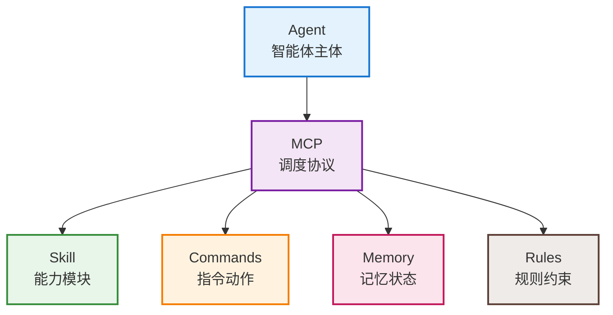

# AI Agent 核心组件

```mermaid
graph TB
    A[Agent<br/>智能体主体] --> M[MCP<br/>调度协议]
    M --> S[Skill<br/>能力模块]
    M --> C[Commands<br/>指令动作]
    M --> Me[Memory<br/>记忆状态]
    M --> R[Rules<br/>规则约束]

    style A fill:#e3f2fd,stroke:#1976d2,stroke-width:2px
    style M fill:#f3e5f5,stroke:#7b1fa2,stroke-width:2px
    style S fill:#e8f5e9,stroke:#388e3c,stroke-width:2px
    style C fill:#fff3e0,stroke:#f57c00,stroke-width:2px
    style Me fill:#fce4ec,stroke:#c2185b,stroke-width:2px
    style R fill:#efebe9,stroke:#5d4037,stroke-width:2px
```

Agent

决策、规划、控制

MCP

模型上下文协议

Skill

能力模块

Commands

指令动作

Memory

记忆状态

Rules

规则约束

