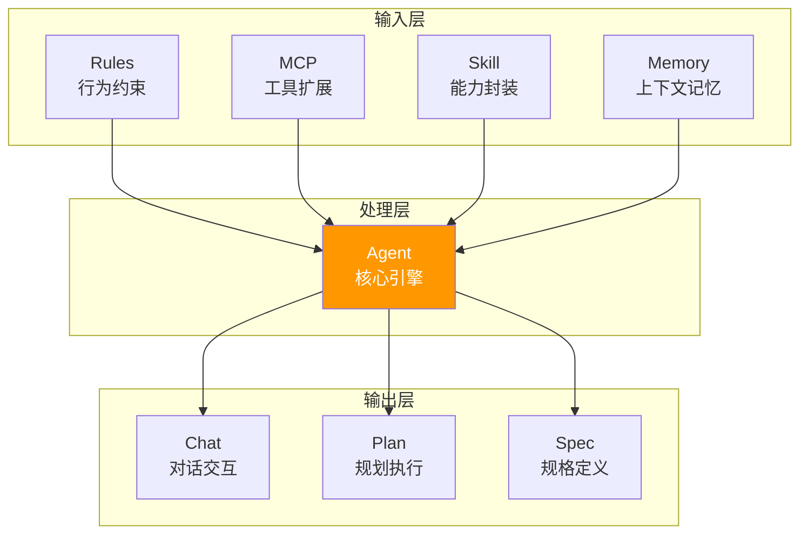

# AI Agent 核心组件

```mermaid {scale: 0.7}
graph TB
    subgraph 输入层
        R[Rules<br/>行为约束]
        M[MCP<br/>工具扩展]
        S[Skill<br/>能力封装]
        Me[Memory<br/>上下文记忆]
    end

    subgraph 处理层
        A[Agent<br/>核心引擎]
    end

    subgraph 输出层
        C[Chat<br/>对话交互]
        P[Plan<br/>规划执行]
        Sp[Spec<br/>规格定义]
    end

    R --> A
    M --> A
    S --> A
    Me --> A
    A --> C
    A --> P
    A --> Sp

    style A fill:#ff9800,color:#fff
```

