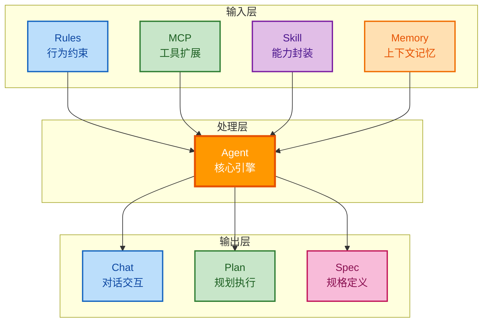

# AI Agent 核心组件

```mermaid {scale: 1.0}
graph TB
    subgraph 输入层
        direction LR
        R[Rules<br/>行为约束]
        M[MCP<br/>工具扩展]
        S[Skill<br/>能力封装]
        Me[Memory<br/>上下文记忆]
    end

    subgraph 处理层
        A[Agent<br/>核心引擎]
    end

    subgraph 输出层
        direction LR
        C[Chat<br/>对话交互]
        P[Plan<br/>规划执行]
        Sp[Spec<br/>规格定义]
    end

    R --> A
    M --> A
    S --> A
    Me --> A
    A --> C
    A --> P
    A --> Sp

    style A fill:#ff9800,stroke:#e65100,stroke-width:3px,color:#fff
    style R fill:#bbdefb,stroke:#1565c0,stroke-width:2px,color:#0d47a1
    style M fill:#c8e6c9,stroke:#2e7d32,stroke-width:2px,color:#1b5e20
    style S fill:#e1bee7,stroke:#7b1fa2,stroke-width:2px,color:#4a148c
    style Me fill:#ffe0b2,stroke:#ef6c00,stroke-width:2px,color:#e65100
    style C fill:#bbdefb,stroke:#1565c0,stroke-width:2px,color:#0d47a1
    style P fill:#c8e6c9,stroke:#2e7d32,stroke-width:2px,color:#1b5e20
    style Sp fill:#f8bbd9,stroke:#c2185b,stroke-width:2px,color:#880e4f
```

