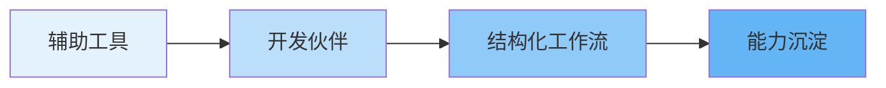

# 为什么关注 AI Coding

<v-clicks>

### 关键转折点

AI Coding 已从 **"辅助工具"** 进化为 **"开发伙伴"**

**Skill 的出现是关键转折：**

- 从"对话"到"结构化工作流"
- 可复用、可组合的能力单元
- 重新审视开发流程的契机

</v-clicks>

::right::

<v-click>

**核心洞察**

上下文工程正在取代提示词工程

</v-click>

