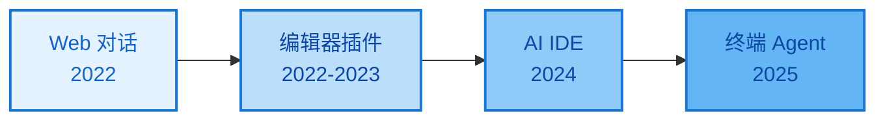

# 发展历程

```mermaid
graph LR
    A[Web 对话<br/>2022] --> B[编辑器插件<br/>2022-2023]
    B --> C[AI IDE<br/>2024]
    C --> D[终端 Agent<br/>2025]

    style A fill:#e3f2fd,stroke:#1976d2,stroke-width:2px,color:#1565c0
    style B fill:#bbdefb,stroke:#1976d2,stroke-width:2px,color:#0d47a1
    style C fill:#90caf9,stroke:#1976d2,stroke-width:2px,color:#0d47a1
    style D fill:#64b5f6,stroke:#1976d2,stroke-width:2px,color:#0d47a1
```

Web 对话

上下文断裂

编辑器插件

集成但受限

AI IDE

一体化体验

终端 Agent

自主执行

