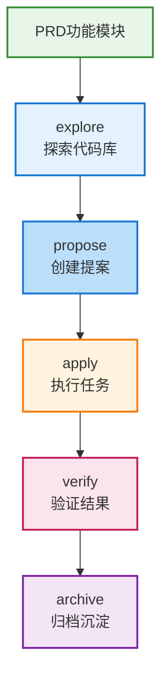

# 开发阶段（核心流程）

<v-clicks>

**explore**
探索现有代码库，理解架构

**propose**
生成 proposal、design、spec、task

**apply**
按 tasks.md 逐项执行，触发 superpowers

**verify**
运行测试，验证实现符合规格

**archive**
归档变更，知识固化到主规格

</v-clicks>
