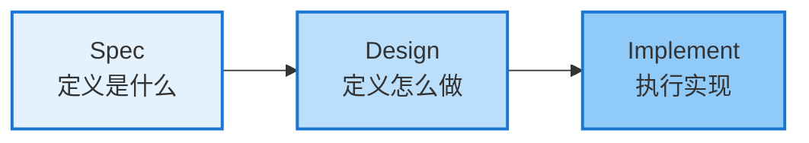

# 什么是 SDD？

<v-clicks>

> **规格驱动开发（Spec-Driven Development）**
>
> 在写任何一行代码之前，先锁定机器可读、人可评审的规格文档。

</v-clicks>

<v-click>

</v-click>

<v-clicks>

**❌ 传统方式的问题**

- 需求淹没在聊天历史中
- 模糊提示导致不确定输出
- 多个功能混在一起
- 团队不知情，难以协作

**✅ SDD 的优势**

- 独立规范文件夹，可追溯
- 明确规范带来可预测结果
- 每个变更独立文件夹结构
- 规范文档可共享和审查

</v-clicks>

